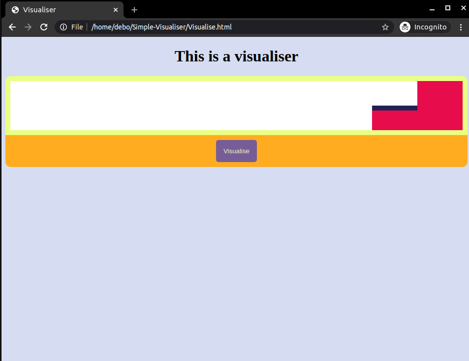

Readme
___
# Visualisers
___
Its a simple web visualiser using `Javascript` `HTML` and `CSS`.
Just open the above [visualise.html](visualise.html) or [wave.html](wave.html) in any popular browser 
1. First one visualise.html is simple implementation of a visualiser.
2. Second one wave.html is representation of a wave where a speed can be reset and can see wave at different speeds.
___
___
## Animation
<h1>VISUALISE</h1>

___

<h1>WAVE</h1>

___
___
## ScreenShots
<h1> Visualise.html </h1>

<h1> wave.html </h1>

___
___
