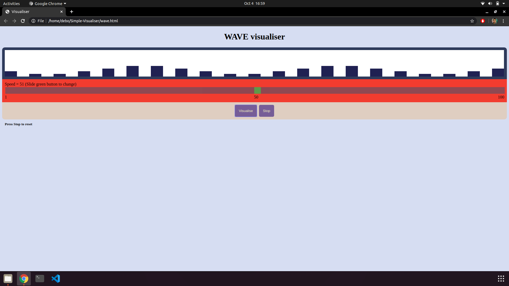

Readme
___
# Visualisers
___
Its a simple web visualiser using `Javascript` `HTML` and `CSS`.
Just open the above [visualise.html](visualise.html) in any browser 
1. First one visualise.html is simple implementation of a visualiser.
2. Second one wave.html is representation of a wave where a speed can be reset and can see wave at different speeds.
___
## ScreenShots

___
